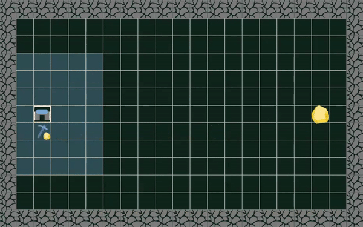
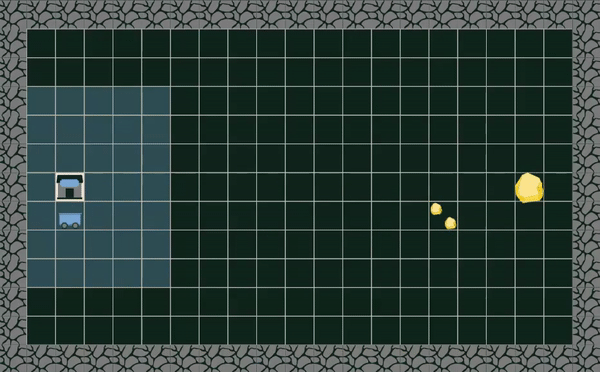
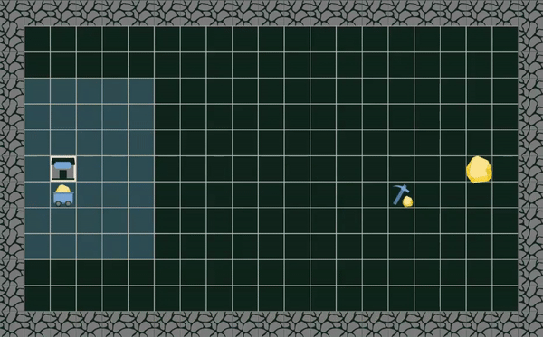
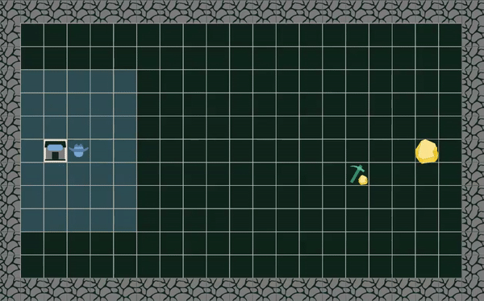

# THE GAME - THE BLITZIUM RUSH

Howdy partner! In the midst of the far west conquest, you are managing a crew whose goal is to become the richest of the territory, by whatever means it takes. To achieve this, you must mine the most precious resource there is, the **Blitzium**, and bring it back to your home base. Be careful, you won't be alone in this enterprise!

To meet your ends, recruit employees in the local saloon who will help you achieve your goal, in exchange for a certain price. A balance must be struck between hoarding the **Blitzium** and spending it to get more. The winning team will be the one with the most **Blitzium** at the end of the game. 

By recruiting a **miner**, you will be able to mine rocks and extract the **Blitzium** they contained. The miners are unfortunately ill-equipped to efficiently carry this resource. To solve this issue, **carts** are units meant to transport it to your **crew**. That being said, don’t expect all others to play fair and square! These two units, as helpful as they are, will need defense! This is why you might have to hire some **outlaws** to guarantee the protection of your resources and maybe, you know, get some more from opponents that are less protected.

## Turns
For each turn, crews must respond with the list of all their actions for each of their units and potentially one (1) recruitment order for one (1) new unit. In the case where a crew would take too much time to answer (100 ms), an off day will be declared for all its units.

## Moving

It is possible for a unit to move toward any destination. They follow a “known path” on the territory toward the desired destination. Be aware that “known paths” are known by all crews, so they will be able to figure out your objective. If a path is blocked, the unit will try to find an alternate route.

## Acquiring Blitzium

Miners can mine Blitzium from mines containing infinite Blitzium. They mine 1 Blitzium per turn. It is also possible to find Blitzium as a depot left by another unit on the ground. Those depots can be picked up by miners or carts, in respect to the amount of Blitziums they can carry.

# Moving Blitizum

It is possible for miners to carry Blitzium, but they are limited to 5 Blitziums. If a minor accumulates more than 5 Blitziums, they won’t be able to move, but will still be able to mine until they reach 50 Blitziums. Alternatively, carts can move up to 25 Blitziums, which makes them a unit of choice for this kind of task. Outlaws cannot move Blitzium.

# Transferring Blitzium

There are many ways to transfer Blitzium from one unit to another:

1. A unit can drop Blitzium on the floor, creating a depot that can be picked up by another unit. Be aware that units from other crews can be picked up as well.
2. It is possible to pick up Blitzium carried by an adjacent unit. E.g., a cart can pick up Blitzium from a miner to bring it back to the home base.
3. It is possible to drop Blitzium on an adjacent unit. E.g., a cart can drop its Blitzium in another cart.
4. It is possible to drop Blitzium directly in your home base. This is how Blitzium will get added to your reserve.

## Duel

In the case where an outlaw is adjacent to another unit, they can trigger a duel and attack the adjacent unit. The targeted unit will be removed from the territory. In the case where two outlaws are attacking each other, the first one who declares their action to the server will win and survive. Be careful, attacking another unit comes with a risk; your outlaw has an 80% chance of survival against a miner or a cart but only a 50% chance against another outlaw.

## Death of a Unit

An attacked unit will disappear from the map leaving all the Blitziums it had on the ground forming a new depot. This depot could be picked up by any other unit, allied or not, in respect to the amount of Blitziums they can carry. In the event the last miner of a crew dies, a new one will be provided at no cost, at the end of the next turn.

## Safe Zones

Zones surrounding crews starting points are considered safe; units from other crews can’t enter. The safe zone is 7 squares by 7 squares around your home base.

## Square Types

| Type | Description |
| ----------- | ----------- |
| Empty | The desert’s warm and dry air is scorching your face, there is nothing but anguish and emptiness with you in this lonely place. |
| Wall | A tall mountain is blocking your way in this direction. Another path must be taken. |
| Blitzium (mine) | The rare material is plenty. Quick, a miner will allow you to extract and bring it back to the crew. |
| Home Base | The crew is your home, it is also where new units will join and where you can drop the Blitzium you have gathered on the territory. |
| Depot | What is this?! Blitzium on the ground! Pick it up and bring it back to the crew. |
| Miner | This unit allows you to mine Blitzium and can transport a small amount (5) of it. It can hold more (25), but then it can't move anymore. |
| Cart | This unit is really efficient to transport large quantities of Blitzium. |
| Outlaw | This unit can make other units “disappear”. |
| Safe Zone | This zone allows your unit to rest in security, enemy units can’t enter. |

## Recruiting Costs

Every unit has a starting recruitment cost associated with it. Also, the more units you recruit, the more expensive recruiting units will be. Be smart with the buying order of your units. Only one unit can be added to your crew per turn. 

## Scoring

Your score is calculated based on the Blitzium you brought back to the crew, minus all expenses. In other words, how many Blitziums contain your reserve at the end of the last turn.

## End of the Game

Each game has a predetermined number of turns. After what, the team with the highest score wins.
